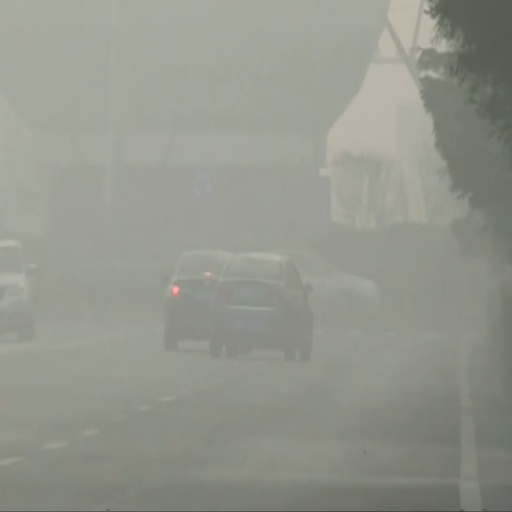
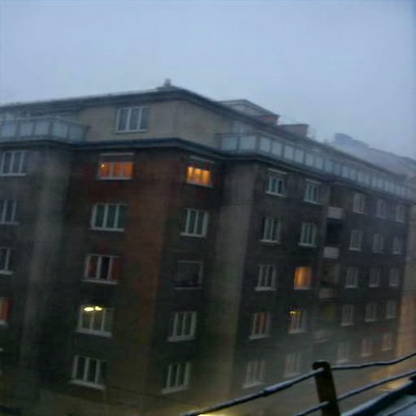
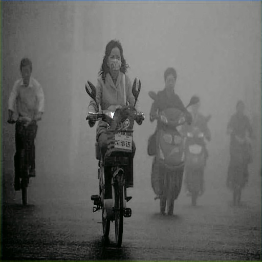

# Single Image Dehazing Algorithm Based on YUV Color Space

A single-image dehazing algorithm based on GAN network for color restoration in YUV color space is proposed(YUVRecolorDehazeNet, YUVRDNet). Inspired by the GAN image coloring task, the algorithm converts the hazy image to YUV color space, weakens the effect of haze in the Y channel, and performs color restoration on the image in the UV channel to achieve dehazing. Meanwhile, skip connections are used to fuse low-level and high-level features for more precise dehazing.

**Pre-trained model**: 

- Baidu Cloud: [url](https://pan.baidu.com/s/1iDszwF7vNuliNuGNcPfk2Q?pwd=yic3), Extraction code: yic3
- Google Drive: [url](https://drive.google.com/file/d/1v4k1LzI7Ozo99D3N7SxBHf1iogRiCJEz/view?usp=sharing)

<table>
  <tr>
    <td align="center"></td>
    <td align="center"></td>
    <td align="center"></td>
    <td align="center"></td>
  </tr>
  <tr>
    <td align="center"></td>
    <td align="center"></td>
    <td align="center"></td>
    <td align="center"></td>
  </tr>
</table>
